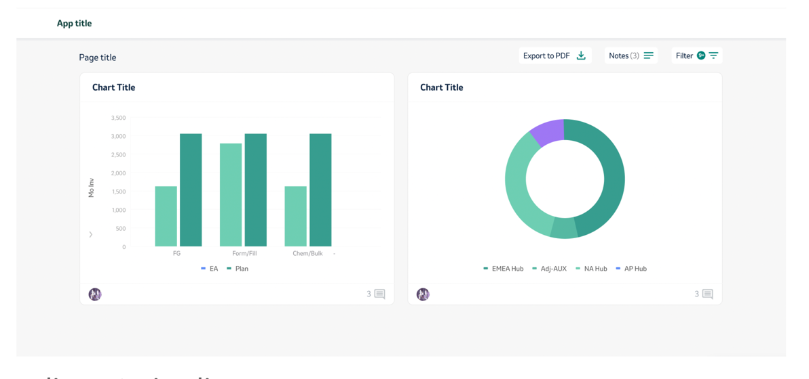

# Covid stats (next.js tRPC prisma)

msd test task

## Requirements

The aim of this exercise is to create single web application that will consume data from remote API and will render pulled data in charts
- Use TypeScript
- Use next.js framework for building web application
- Use ant.d library for UI and components on the page
- Use remote API for data - https://coronavirus.data.gov.uk/details/developers-guide/main-api
- ^^^ no longer avaliable btw...
- Use g2.antv for render charts (any chart types can be used, up to your selection)
- [OPTIONAL] Use trpc library for backend services and endpoints (use db up to your selection (eg., https://railway.app/))

### Design of page (example on the attached screenshot):

- The page will consist from page header and content area
- Page header contains only title
- Content area contains two cards with charts (any chart type is possible) with dummy avatar and dummy
button as per picture
- Above charts, there is a space (a panel) for Page title and dummy buttons (as per design, without any logic
behind)
- [OPTIONAL] Add a heart icon (not on design below!) to cards which allows visitors to select card as a favorite
(use trpc for this feature)

### Deploy

Link [vercel platform](https://github.com/)
